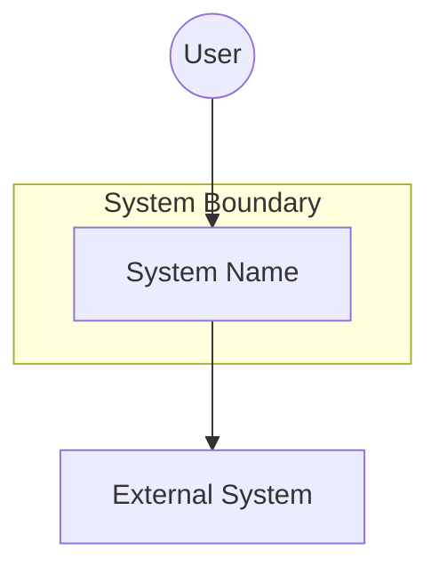
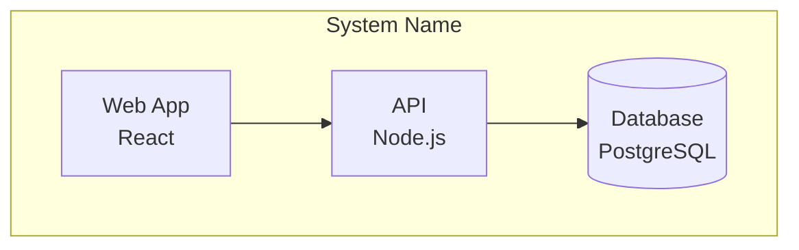
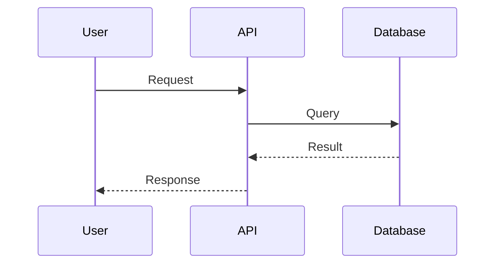
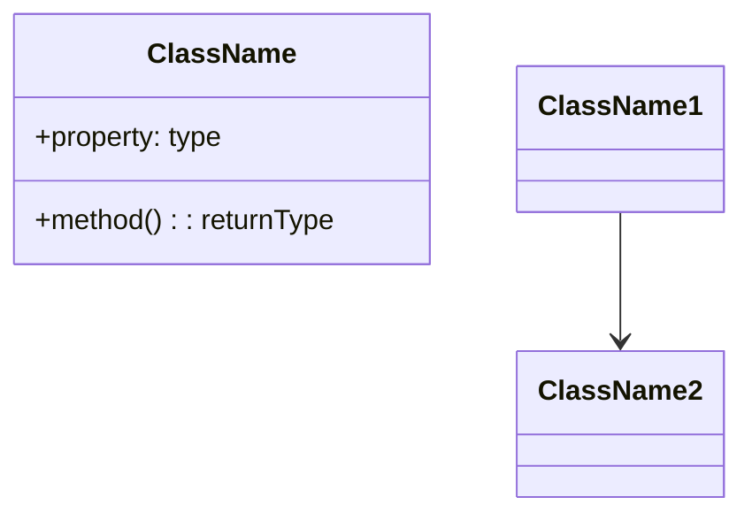
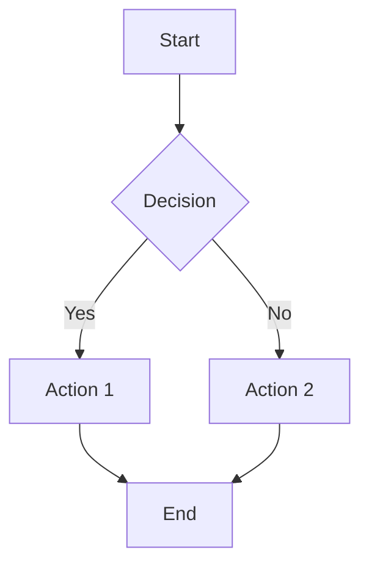

# Codebase Exploration Skill

You are tasked with exploring an unfamiliar codebase and generating comprehensive documentation. This documentation will help developers understand the codebase quickly and effectively.

## Context

- Current directory: !`pwd`
- Git repository: !`git remote -v 2>/dev/null | head -1 || echo "Not a git repo"`
- Recent commit activity: !`git log --oneline -20 2>/dev/null || echo "No git history"`
- Primary languages: !`git ls-files 2>/dev/null | sed 's/.*\.//' | sort | uniq -c | sort -rn | head -10 || echo "Unknown"`

## Output Location

All documentation will be placed in the `docs/exploration/` directory within the repository.

## Exploration Process

### Phase 1: Initial Discovery

1. **Repository Structure Analysis**
   - Map the top-level directory structure
   - Identify key directories (src, lib, test, config, etc.)
   - Find configuration files (package.json, Cargo.toml, Gemfile, etc.)
   - Locate existing documentation (README, docs/, wiki/)

2. **Git History Analysis**
   - Identify most active files (churn analysis)
   - Find primary contributors
   - Analyze commit patterns and conventions
   - Identify major milestones/releases via tags

3. **Documentation Discovery**
   - Read all README files
   - Review any existing architecture documents
   - Check for API documentation
   - Look for inline documentation patterns

4. **Configuration Discovery**
   - Find all configuration file formats (.env, .yaml, .json, .toml, .ini, etc.)
   - Identify environment variable usage (search for `os.environ`, `process.env`, `ENV[]`, etc.)
   - Locate CLI argument parsing (argparse, commander, clap, etc.)
   - Find configuration loading code to understand precedence
   - Identify default values in code
   - Check for environment-specific config files (development, staging, production)

### Phase 2: Code Analysis

1. **Entry Points**
   - Find main entry points (main(), index.*, app.*, etc.)
   - Identify public APIs or interfaces
   - Map request/response flows for web applications
   - Identify CLI commands for command-line tools

2. **Core Components**
   - Identify major modules/packages/namespaces
   - Map dependencies between components
   - Find shared utilities and common code
   - Identify external service integrations

3. **Data Layer**
   - Locate data models/entities
   - Identify database schemas or migrations
   - Find data access patterns (repositories, DAOs, etc.)
   - Map data flow through the system

### Phase 3: Pattern Recognition

1. **Design Patterns**
   - Identify architectural patterns (MVC, Clean Architecture, etc.)
   - Find common design patterns in use
   - Note any anti-patterns or code smells
   - Document naming conventions

2. **Hot Spots**
   - Files with high complexity (many dependencies)
   - Files with high churn (frequently modified)
   - Large files or functions
   - Areas with poor test coverage
   - Known technical debt indicators

## Required Output Documents

Create the following documents in `docs/exploration/`:

### 1. `00-overview.md` - Purpose and Capabilities Summary
```markdown
# [Project Name] Overview

## Purpose
[Clear statement of what this software does and why it exists]

## Key Capabilities
[Bulleted list of main features/capabilities]

## Technology Stack
[Languages, frameworks, databases, external services]

## Getting Started
[Quick start for new developers]
```

### 2. `01-architecture-c4.md` - C4 Model Diagrams
Create diagrams at each C4 level using mermaid:

```markdown
# C4 Architecture Model

## Level 1: System Context
[Mermaid diagram showing the system and external actors/systems]

## Level 2: Container Diagram
[Mermaid diagram showing major containers: apps, databases, etc.]

## Level 3: Component Diagram
[Mermaid diagram showing components within key containers]

## Level 4: Code (for critical components)
[Mermaid class diagrams for important classes/modules]
```

### 3. `02-architecture-4plus1.md` - 4+1 View Model
```markdown
# 4+1 Architectural View Model

## Logical View
The structural decomposition of the system into classes, packages, and modules.

### Class/Package Structure
[Mermaid class diagram showing key domain classes and their relationships]

'''mermaid
classDiagram
    class DomainEntity {
        +id: string
        +property: type
        +method(): returnType
    }
    DomainEntity --> RelatedEntity
'''

### Domain Model
[Mermaid diagram showing domain entities and aggregates]

## Process View
Runtime behavior of the system - how processes, threads, and tasks interact.

### Concurrency Model
[Description of threading/async model]

### Process Communication
[Mermaid sequence diagram showing inter-process or inter-service communication]

'''mermaid
sequenceDiagram
    participant P1 as Process/Service 1
    participant Q as Message Queue
    participant P2 as Process/Service 2
    P1->>Q: Publish message
    Q->>P2: Deliver message
    P2-->>Q: Acknowledge
'''

### Thread/Task Lifecycle
[Mermaid state diagram showing task states]

'''mermaid
stateDiagram-v2
    [*] --> Pending
    Pending --> Running: Start
    Running --> Completed: Success
    Running --> Failed: Error
    Failed --> Pending: Retry
    Completed --> [*]
'''

## Development View
How the codebase is organized for development.

### Module Dependencies
[Mermaid flowchart showing module/package dependencies]

'''mermaid
flowchart LR
    subgraph Core
        domain[Domain]
        services[Services]
    end
    subgraph Infrastructure
        db[Database]
        api[API]
    end
    api --> services
    services --> domain
    services --> db
'''

### Build Pipeline
[Mermaid flowchart showing build/CI process]

## Physical View
Deployment topology and infrastructure.

### Deployment Diagram
[Mermaid flowchart showing deployment architecture]

'''mermaid
flowchart TB
    subgraph Cloud [Cloud Provider]
        subgraph VPC [VPC]
            lb[Load Balancer]
            subgraph Compute [Compute]
                app1[App Instance 1]
                app2[App Instance 2]
            end
            subgraph Data [Data Tier]
                db[(Database)]
                cache[(Cache)]
            end
        end
    end
    users((Users)) --> lb
    lb --> app1 & app2
    app1 & app2 --> db & cache
'''

### Infrastructure Components
[Table of infrastructure components and their purpose]

## Scenarios/Use Cases
Key use cases that demonstrate how the views work together.

### Scenario 1: [Primary Use Case]
[Mermaid sequence diagram showing end-to-end flow]

'''mermaid
sequenceDiagram
    actor User
    participant UI
    participant API
    participant Service
    participant DB
    User->>UI: Action
    UI->>API: Request
    API->>Service: Process
    Service->>DB: Query
    DB-->>Service: Result
    Service-->>API: Response
    API-->>UI: Data
    UI-->>User: Display
'''

### Scenario 2: [Secondary Use Case]
[Another key scenario]
```

**Note:** The 4+1 Process View focuses on **system-level runtime architecture** (threads, processes, synchronization, IPC). For **business workflows and feature-level processes**, see [Process Diagrams](03-process-diagrams.md).

### 4. `03-process-diagrams.md` - Business Process Flows
```markdown
# Process Diagrams - Business & Feature Workflows

This document describes **business-level workflows and feature processes** using the most
appropriate diagram type for each scenario. For system-level runtime architecture (threads,
processes, concurrency), see [4+1 Process View](02-architecture-4plus1.md).

## Diagram Type Selection Guide

Choose the diagram type that best communicates the process:

| Diagram Type | Best For | Use When |
|--------------|----------|----------|
| **Flowchart** | Decision-based workflows | Process has branching logic, conditionals, loops |
| **Sequence** | Multi-actor interactions | Multiple components/services communicate in order |
| **State** | Entity lifecycles | An entity transitions through distinct states |
| **Journey** | User experience flows | Documenting user emotions/experience through steps |
| **Gantt** | Time-based processes | Steps have duration, parallelism, dependencies |
| **Entity Relationship** | Data relationships | Showing how data entities connect |

---

## Flowchart Diagrams

Use flowcharts for processes with **decision points, branches, and loops**.

### Example: [User Registration Flow]

**Description:** [What this workflow accomplishes]

**Trigger:** [What initiates this process]

'''mermaid
flowchart TD
    A[User visits signup page] --> B[Enter email and password]
    B --> C{Valid input?}
    C -->|No| D[Show validation errors]
    D --> B
    C -->|Yes| E[Create user record]
    E --> F[Send verification email]
    F --> G[Show confirmation page]
    G --> H{User clicks verify link?}
    H -->|Yes| I[Activate account]
    H -->|No, expires| J[Delete pending user]
    I --> K[Redirect to dashboard]
'''

**Key Decision Points:**
- [Decision 1]: [What determines the outcome]

---

## Sequence Diagrams

Use sequence diagrams for **interactions between multiple actors, services, or components**.

### Example: [Order Processing Flow]

**Description:** [What this interaction accomplishes]

**Participants:** [Systems/actors involved]

'''mermaid
sequenceDiagram
    actor User
    participant Web as Web App
    participant API as Order API
    participant Inv as Inventory Service
    participant Pay as Payment Gateway
    participant DB as Database

    User->>Web: Place order
    Web->>API: POST /orders
    API->>Inv: Check availability
    Inv-->>API: Items available

    API->>Pay: Process payment
    alt Payment successful
        Pay-->>API: Payment confirmed
        API->>DB: Save order
        API->>Inv: Reserve items
        API-->>Web: Order confirmed
        Web-->>User: Show confirmation
    else Payment failed
        Pay-->>API: Payment declined
        API-->>Web: Payment error
        Web-->>User: Show error, retry options
    end
'''

**Error Scenarios:**
- [Scenario]: [How it's handled]

---

## State Diagrams

Use state diagrams for **entities that transition through distinct lifecycle states**.

### Example: [Order Lifecycle]

**Entity:** [What entity this describes]

**States:** [Brief description of each state]

'''mermaid
stateDiagram-v2
    [*] --> Draft: Create order

    Draft --> Pending: Submit
    Draft --> Cancelled: User cancels

    Pending --> PaymentProcessing: Begin checkout
    Pending --> Cancelled: Timeout/User cancels

    PaymentProcessing --> Confirmed: Payment success
    PaymentProcessing --> PaymentFailed: Payment declined

    PaymentFailed --> PaymentProcessing: Retry
    PaymentFailed --> Cancelled: Max retries exceeded

    Confirmed --> Processing: Begin fulfillment
    Confirmed --> Cancelled: Admin cancel

    Processing --> Shipped: Items dispatched
    Processing --> PartiallyShipped: Some items dispatched

    PartiallyShipped --> Shipped: Remaining items dispatched

    Shipped --> Delivered: Delivery confirmed
    Shipped --> DeliveryFailed: Delivery failed

    DeliveryFailed --> Shipped: Re-attempt delivery
    DeliveryFailed --> Returned: Return to sender

    Delivered --> [*]
    Cancelled --> [*]
    Returned --> Refunded
    Refunded --> [*]
'''

**State Descriptions:**
| State | Description | Valid Transitions |
|-------|-------------|-------------------|
| Draft | Order created but not submitted | Pending, Cancelled |
| Pending | Awaiting payment | PaymentProcessing, Cancelled |

**Transition Rules:**
- [Transition]: [Conditions/business rules]

---

## User Journey Diagrams

Use journey diagrams to document **user experience and emotional states** through a process.

### Example: [New User Onboarding Journey]

**Persona:** [Who this journey describes]

'''mermaid
journey
    title New User Onboarding Experience
    section Discovery
        Find product via search: 3: User
        Visit landing page: 4: User
        Read features: 4: User
    section Signup
        Click signup button: 5: User
        Fill registration form: 3: User
        Verify email: 2: User
        Complete profile: 3: User
    section First Use
        View tutorial: 4: User
        Try first feature: 4: User
        Get stuck on advanced feature: 2: User
        Find help documentation: 4: User
        Complete first task successfully: 5: User
'''

**Pain Points Identified:**
- [Step]: [Issue and potential improvement]

---

## Gantt/Timeline Diagrams

Use Gantt diagrams for **time-based processes with duration and dependencies**.

### Example: [Data Pipeline Schedule]

**Purpose:** [What this timeline shows]

'''mermaid
gantt
    title Daily Data Processing Pipeline
    dateFormat HH:mm
    axisFormat %H:%M

    section Data Ingestion
        Fetch raw data from API     :a1, 00:00, 30m
        Fetch data from partners    :a2, 00:00, 45m
        Validate incoming data      :a3, after a1 a2, 15m

    section Processing
        Transform and clean data    :b1, after a3, 1h
        Run aggregations            :b2, after b1, 30m
        Generate derived metrics    :b3, after b1, 45m

    section Output
        Update database             :c1, after b2 b3, 20m
        Generate reports            :c2, after c1, 30m
        Send notifications          :c3, after c2, 10m
'''

**Dependencies:**
- [Task]: [What it depends on and why]

---

## Entity Relationship Diagrams

Use ER diagrams to show **data relationships** relevant to a process.

### Example: [Order Domain Model]

'''mermaid
erDiagram
    Customer ||--o{ Order : places
    Order ||--|{ OrderLine : contains
    Order ||--|| Payment : "paid by"
    Order }|--|| ShippingAddress : "shipped to"
    OrderLine }|--|| Product : references
    Product }|--|| Category : "belongs to"
    Product ||--o{ Inventory : "stocked in"

    Customer {
        string id PK
        string email
        string name
    }
    Order {
        string id PK
        string customerId FK
        string status
        datetime createdAt
    }
    OrderLine {
        string id PK
        string orderId FK
        string productId FK
        int quantity
        decimal price
    }
'''

---

## Complex Multi-Diagram Processes

For complex processes, combine multiple diagram types.

### Example: [Recommendation Engine Pipeline]

#### Overview (Flowchart)

'''mermaid
flowchart LR
    A[User Request] --> B[Feature Extraction]
    B --> C[Model Inference]
    C --> D[Post-Processing]
    D --> E[Response]
'''

#### Component Interaction (Sequence)

'''mermaid
sequenceDiagram
    participant Client
    participant API
    participant FeatureStore
    participant MLModel
    participant Cache

    Client->>API: Get recommendations
    API->>Cache: Check cache
    alt Cache hit
        Cache-->>API: Cached results
    else Cache miss
        API->>FeatureStore: Get user features
        FeatureStore-->>API: Feature vector
        API->>MLModel: Inference request
        MLModel-->>API: Predictions
        API->>Cache: Store results
    end
    API-->>Client: Recommendations
'''

#### Model State (State Diagram)

'''mermaid
stateDiagram-v2
    [*] --> Training
    Training --> Validating: Training complete
    Validating --> Staging: Validation passed
    Validating --> Training: Validation failed
    Staging --> Production: Approved
    Staging --> Archived: Rejected
    Production --> Staging: New model ready
    Production --> Archived: Deprecated
    Archived --> [*]
'''
```

**Note:** Process diagrams focus on **what the business/feature does**, while the 4+1 Process View focuses on **how the system executes at runtime**.

### 5. `04-code-organization.md` - Structure and Patterns
```markdown
# Code Organization

## Directory Structure
[Annotated tree view of important directories]

## Module/Package Organization
[How code is logically organized]

## Common Design Patterns
[Patterns used throughout the codebase with examples]

## Coding Conventions
[Naming, formatting, file organization conventions]
```

### 6. `05-domain-context.md` - Domain Knowledge
```markdown
# Domain Context

## Business Domain
[What business/problem domain this software operates in]

## Key Concepts
[Core domain concepts and their relationships]

## Domain Model
[Mermaid diagram of domain entities and relationships]

## Important Business Rules
[Key business logic that's critical to understand]
```

### 7. `06-glossary.md` - Terms and Definitions
```markdown
# Glossary

| Term | Definition | Context |
|------|------------|---------|
| [term] | [definition] | [where it's used] |
```

### 8. `07-hotspots.md` - Troublesome Code Areas
```markdown
# Code Hotspots and Risk Areas

## High Churn Files
[Files that change frequently - potential instability]

## Complex Components
[Areas with high cyclomatic complexity or many dependencies]

## Technical Debt
[Identified areas of technical debt]

## Known Issues
[Problem areas mentioned in comments, TODOs, or git history]

## Recommendations
[Suggestions for addressing these hotspots]
```

### 9. `08-configuration.md` - Configuration Options
```markdown
# Configuration Guide

## Configuration Sources

This application can be configured through multiple sources. When the same option
is set in multiple places, they are resolved in the following precedence order
(highest to lowest):

1. [Highest precedence source, e.g., CLI arguments]
2. [Next source, e.g., Environment variables]
3. [Next source, e.g., Config file]
4. [Lowest precedence, e.g., Default values]

## Configuration Options Reference

### [Category Name, e.g., Database Settings]

| Option | Description | Type | Default | Required |
|--------|-------------|------|---------|----------|
| `OPTION_NAME` | What this option controls | string/int/bool | `default_value` | Yes/No |

**How to set:**

| Method | Syntax | Example |
|--------|--------|---------|
| Environment Variable | `OPTION_NAME=value` | `OPTION_NAME=production` |
| Config File (.env) | `OPTION_NAME=value` | `OPTION_NAME=production` |
| CLI Argument | `--option-name value` | `--option-name production` |
| Code/Programmatic | `config.optionName = value` | `config.optionName = "production"` |

### [Next Category...]

## Configuration Files

### File Locations
[Where configuration files are loaded from, in order of precedence]

| File | Location | Purpose |
|------|----------|---------|
| `.env` | Project root | Local development overrides |
| `.env.local` | Project root | Machine-specific settings (gitignored) |
| `config/settings.yaml` | Config directory | Application settings |

### File Formats
[Supported configuration file formats and their syntax]

## Environment-Specific Configuration

### Development
[Development-specific settings and how to configure them]

### Staging
[Staging-specific settings]

### Production
[Production-specific settings and security considerations]

## Precedence Examples

### Example 1: Database URL
If `DATABASE_URL` is set in multiple places:
- CLI: `--database-url postgres://cli-host/db`
- Environment: `DATABASE_URL=postgres://env-host/db`
- .env file: `DATABASE_URL=postgres://file-host/db`

**Result:** The CLI value (`postgres://cli-host/db`) is used because CLI has highest precedence.

### Example 2: [Another common configuration scenario]
[Explain the precedence resolution]

## Secrets and Sensitive Configuration

### Recommended Practices
[How to handle secrets - environment variables, secret managers, etc.]

### Never Commit
[List of files/patterns that should never be committed]

## Validation and Debugging

### Viewing Active Configuration
[How to see what configuration values are actually being used]

### Common Issues
[Troubleshooting configuration problems]
```

### 10. `09-index.md` - Documentation Index
```markdown
# Documentation Index

## Quick Links
- [Overview](00-overview.md)
- [C4 Architecture](01-architecture-c4.md)
- [4+1 Views](02-architecture-4plus1.md)
- [Process Diagrams](03-process-diagrams.md)
- [Code Organization](04-code-organization.md)
- [Domain Context](05-domain-context.md)
- [Glossary](06-glossary.md)
- [Hotspots](07-hotspots.md)
- [Configuration](08-configuration.md)

## Document Descriptions
[Brief description of each document's purpose]
```

## Mermaid Diagram Guidelines

Use appropriate mermaid diagram types:

### C4 Context Diagram (use flowchart)


### C4 Container Diagram


### Sequence Diagrams


### Class Diagrams


### Activity/Flowcharts


## Execution Instructions

1. **Use the Explore agent** to thoroughly investigate the codebase structure
2. **Analyze git history** with commands like:
   - `git log --oneline --all` for commit history
   - `git log --format='%aN' | sort | uniq -c | sort -rn` for contributors
   - `git log --pretty=format: --name-only | sort | uniq -c | sort -rn | head -20` for most changed files
   - `git tag -l` for releases/milestones
3. **Read key files** starting with READMEs and configuration files
4. **Create the docs/exploration directory** if it doesn't exist
5. **Generate each document** systematically, ensuring accuracy
6. **Use mermaid syntax** for all diagrams
7. **Cross-reference** between documents where appropriate

## Quality Standards

- All diagrams must render correctly in mermaid
- Statements should be backed by evidence from the code
- Use file:line references when citing specific code
- Mark uncertainties explicitly with "[Needs Verification]"
- Keep language clear and jargon-free where possible
- Include the glossary term when first using domain-specific terms

## Begin Exploration

Start by running the Explore agent to gather initial context about the codebase, then systematically create each document. Create the `docs/exploration/` directory first, then generate documents in order from 00 to 09.
